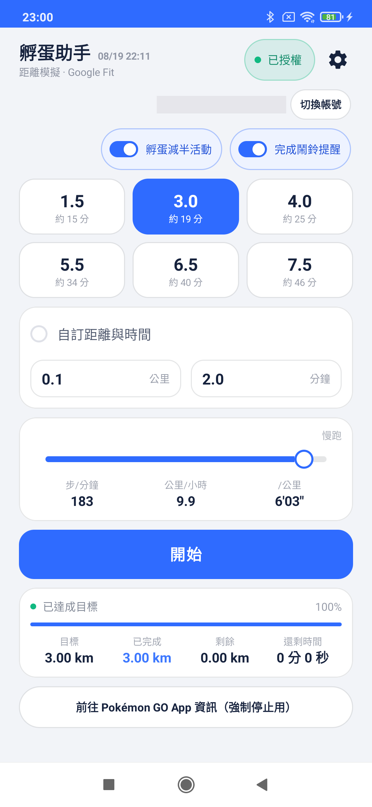

# 孵蛋助手 測試版下載

這裡提供「孵蛋助手」App 的測試版 APK 給受邀的測試者下載安裝。這個 repo **只放安裝檔與操作說明，不含原始碼**。

> 目前僅開放小規模私下測試（上限 40 位使用者），不會、也無法上架 Google Play。

---

## ⚠️ 使用前必讀：這個 App 在做什麼、有什麼風險

**這個 App 會把「模擬出來、你並沒有真的走」的距離與步數，寫進你的 Google Fit 帳號**，讓 Pokémon GO 的 Adventure Sync 誤以為你走了那段路，藉此達成孵蛋所需的距離。請在提供 Gmail、下載安裝之前，先了解以下風險：

- **你的 Pokémon GO 帳號可能有風險。** 用第三方工具產生假的移動資料，很可能違反 Pokémon GO 的使用條款，屬於 Niantic 可能認定的「數據竄改／作弊」行為。一旦被系統判定，輕則 Adventure Sync 功能被停用，重則帳號被警告甚至停權。**這個風險是你自己的遊戲帳號在承擔，開發者無法控制、也不對後果負責。**
- **會永久寫入你真實的 Google Fit 歷史紀錄。** 這些假資料會混進你自己的 Google Fit 帳號資料裡；如果你的 Google Fit 資料還有被別的地方讀取（健康 App、保險方案等），會一併被這些非真實資料影響。
- **這不是官方產品，純屬私下小規模測試。** 沒有客服、沒有保固，功能與穩定性都可能隨時改變或中止。

**繼續安裝並使用，代表你已經理解並自願承擔以上風險。** 如果不能接受，請不要繼續下面的步驟。

---

## 畫面長這樣

（帳號那一列打了馬賽克，其餘都是實際畫面）

---

## 一、開始之前：關於測試名單

App 內的 Google 帳號登入功能目前設定為「測試中」狀態，**沒有事先加入名單的帳號無法完成登入**（會卡在拒絕存取畫面）。

**此專案純屬私人測試性質，名單由開發者本人邀請管理，未受邀請的使用者不會被加入測試清單。** 如果你收到這份連結，代表你已經在邀請範圍內；實際加入名單的流程由開發者另外私下聯繫處理，不需要透過這份文件申請。

---

## 二、下載與安裝

下載方式有兩種，擇一即可：

### 方法一：GitHub 手動下載

👉 [下載 hatch-assistant-v0.2.4-beta.apk](https://github.com/Jerry2-Yao/hatch-assistant-beta/releases/download/v0.2.4-beta/hatch-assistant-v0.2.4-beta.apk)

> 如果你是自己跑去 [Releases 頁面](https://github.com/Jerry2-Yao/hatch-assistant-beta/releases) 找檔案：請點檔名是 `.apk` 的那個，**不要點「Source code (zip)」或「(tar.gz)」**──那兩個是 GitHub 自動附加的原始碼壓縮檔，不是安裝檔，裝不起來。

### 方法二：Firebase App Distribution（之後會自動通知新版本）

用這個方式，之後有新版本會**主動通知**你更新，不用再回來這頁重新下載。

1. 用手機瀏覽器打開：👉 [appdistribution.firebase.google.com](https://appdistribution.firebase.google.com)
2. 用你已加入測試名單的 Google 帳號登入
3. 第一次使用會看到「接受邀請」，請點下去
4. 在測試 App 清單裡找到「孵蛋助手」，點進去後按「Download」下載最新版本
5. 下載完成後，接續下面「安裝時可能遇到的提示」完成安裝

> 想要收到自動更新推播，可以順便點頁面上的「Download App Tester」──這是 Firebase 官方提供的網頁工具，**不是 Play Store 上能搜尋到的 App**，直接從這個網頁下載安裝即可。不裝也沒關係，差別只在於要不要自己回來這個網址檢查新版本。

### 安裝時可能遇到的提示（不管用哪個方法下載都一樣）

**瀏覽器警告「這類檔案可能有害」**
用 Chrome 下載時，通常會跳出「已封鎖不安全的下載內容」或「這類檔案可能會損害你的裝置」的提示。這是因為這個 APK 不是從 Google Play 下載的，屬於正常現象。
點選提示旁邊的「**⋮ 更多**」或「**繼續**」→「**仍要下載**」即可。

**安裝時「不允許安裝不明來源」**
點開下載好的 APK 準備安裝時，系統會擋下並顯示「你的手機不允許安裝來自此來源的不明應用程式」：
1. 點畫面上的「**設定**」
2. 找到「**允許此來源的應用程式**」（通常來源是「Chrome」或「檔案」App）並打開
3. 返回上一頁，重新點一次 APK 完成安裝

**Google Play Protect 掃描警告（若出現）**
如果跳出「Play 保護機制」提示這個 App 可能有害，選「**仍要安裝**」／「**略過檢查**」即可（這是因為它不是 Play 商店的 App，並非真的偵測到病毒）。

---

## 三、第一次開啟 App

打開 App 後會依序遇到幾個系統詢問，都請選「**允許**」：

1. **背景喚醒設定提醒**：App 會請你把它加入「電池最佳化白名單」，這樣孵蛋計畫在背景執行時手機才不會把它殺掉。跳出系統畫面時請選「允許」。
2. **廠牌自啟動提示**（小米/OPPO/vivo/華為機型才會看到）：因為 Android 官方沒有「自啟動」這個機制，App 會用文字提示你去手機自己的設定選單裡手動打開，請照著畫面指示操作一次即可。
3. **Google 帳號登入**：選擇你已經提供信箱、已被加入名單的 Google 帳號。
   - 如果看到「**Google 尚未驗證這個應用程式**」的警告畫面，這是正常的（App 還在測試階段，還沒送 Google 審核），點左下角「**進階**」→「**前往 孵蛋助手（不安全）**」即可繼續。
4. **Health Connect / 健身資料權限**：允許 App 讀寫距離、步數等資料，這是模擬走路資料的核心功能，需要允許。

---

## 四、基本操作說明

- **目標距離**：畫面上方 6 張距離卡片可直接點選（依「孵蛋減半活動」開關會自動變成一半數字）。
- **自訂距離與時間**：點下方卡片，輸入公里數，或公里數+分鐘數（會自動反推速度）。
- **速度調整**：拖動滑桿調整模擬走路速度（3–12 km/h），下方會即時顯示步頻／時速／配速。
- **孵蛋減半活動**開關：Pokémon GO 有這個活動時打開，距離需求會自動減半。
- **完成鬧鈴提醒**開關：打開後，模擬達成目標時手機會響鈴+震動提醒你去開 Pokémon GO；通知上有「停止響鈴」按鈕可以馬上關掉。
- **開始／停止**：按下最下方大按鈕開始模擬，執行中會變成白底紅字的「停止」。
- **進度卡**：顯示目前狀態、進度百分比、目標／已完成／剩餘／還剩時間。
- **最下方「前往 Pokémon GO App 資訊」按鈕**：手動輔助功能，用來快速跳去 Pokémon GO 的系統設定頁強制停止它（第三方 App 沒有權限自動幫你做這件事）。這區未來會重新設計，先求能用。

---

## 五、已知限制

- 僅限已加入測試名單的 Google 帳號使用，帳號**大約每 7 天需要重新登入授權一次**，屬正常現象。
- 這是 Demo／Beta 階段，介面與功能未來仍可能調整。
- 若「開始模擬」後 Pokémon GO 端沒有正確孵蛋（沒新增公里數），建議照 App 內建按鈕跳去手動「強制停止」Pokémon GO 後再重新開啟它一次。

---

## 六、回報問題

測試時如果遇到任何問題、閃退、或畫面怪怪的，麻煩截圖並寄到 `ynp123ai@gmail.com`，附上：
- 手機廠牌/型號
- 大概發生的操作步驟
- 截圖或錄影（如果方便的話）

謝謝你協助測試！
